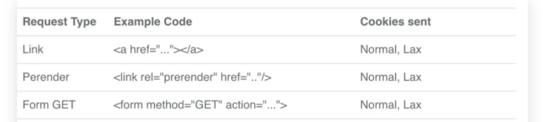
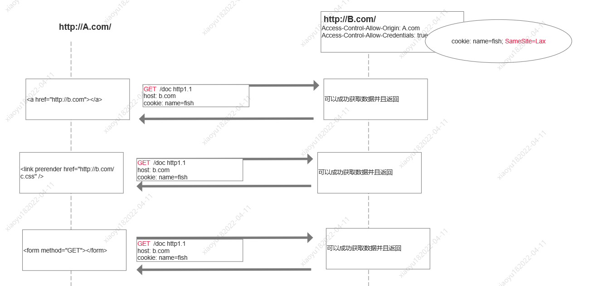
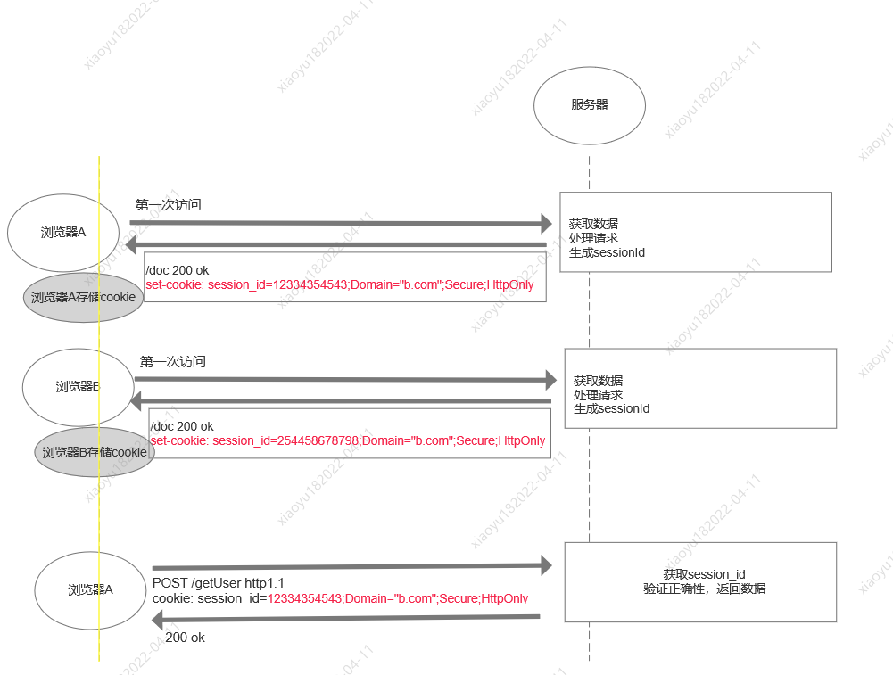

## [cookie](./cookie.md)

### 特点

- 数据大小. 缓存一些数据， 数据量最大为 4kb。 服务器可以通过 `set-cookie` 设置 cookie， 浏览器会存储该 cookie， 并且在发送请求的时候回自动带上（设置了 withCredentials=true）
- cookie 获取。同源【协议相同，域名相同（同域即 host 相同, 顶级域名, 一级域名, 二级域名, 三级域名等必须相同）, 且域名不能与 ip 对应;， 端口号相同】并且未设置为 http-only 的 cookie 可以在浏览器端获取.
- `security`. 设置了 security=true 的 cookie 只能在 https 请求中传输
- 个数限制. [不同浏览器有不同的 cookie 个数限制]（https://www.cnblogs.com/henryhappier/archive/2011/03/03/1969564.html）
- 失效时间. cookie 在失效时间内一直有效，如果未设置失效时间，关闭浏览器就失效
- 如果 iframe 的 url 与父页面同源，或者 ifram 的 url 为子域（www.abc.com），设置了document.domain = abc.com, 那么该子域可以获取到父域设置的 cookie 值。

### Cookie 的设置和读取

```
// 设置cookie
document.cookie ="username1=randy1;expires=Thu, 18 Dec 2043 12:00:00 GMT; path=/
// 读取cookie
document.cookie
```

### Cookie 的属性

- key = value, 设置 cookie 的属性名和属性值
- expires, 设置过期时间，该时间内 cookie 一直有效
- max-age， 设置 cookie 的失效时间，单位为秒。如果值为负数，则浏览器关闭后就失效。 0 表示删除该 cookie. 默认是-1
- path 指定 cookie 在哪个路径下生效，默认是 '/'
- demaim 指定 cookie 在哪个域名下生效，默认是 当前域名
- secure 是否在 https 下面生效
- httpOnly 设置该值，则 js 读取不到这个 cookie 的值
- SameSite `strict`, `Lax`, `None`. 默认值为 `Lax`。 设置为 strict 可以避免 CSRF 攻击。

  - Lax：大多数情况也是不发送第三方 Cookie，但是导航到目标网址的 Get 请求除外( top-level navigations)。  
    导航到目标网址的 Get 请求只包括三种情况：链接，预加载请求
    

    

  - strict: 完全禁止第三方 Cookie

  - None: 当 `Secure` 设置为 `true`, 并且设置了 `withCredentials=true` 的请求都可以携带第三方 cookie

## session

- 代表服务器和客户端之间的一次会话流程。
- 浏览器或者 Tab 页关闭，session 就失效

### session + cookie 的认证流程



[其他的认证流程](./login.md)

### session + cookie 的存在的问题

每个不同客户端去访问服务器都需要生成一个 session_id，存储在服务器端。这样会增大服务器端的压力和维护成本

- 分布式 session，可以将 session 统一集中存储。

## localstorage

- 同源窗口共享
- 长久保存网站数据，只能手动清除
- 可以监听 storage 事件
- 存放 5M 的数据

## sessionStorage

- 同源窗口共享
- 临时保存网站数据，关闭标签页或者窗口就会失效
- 可以监听 storage 事件
- 存放 5M 的数据

## indexDB

## Application Cache

## [PWA(Progressive Web Apps)](./pwa.md)
