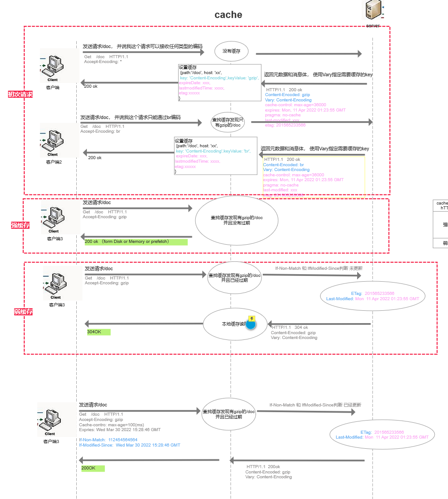

## 前端缓存种类

- HTTP 缓存
- [浏览器缓存](./BrowserCache.md)

## http 缓存规则

### 强缓存

浏览器访问资源的时候，根据第一次请求响应头所返回的 Expires 时间或者 Cache-control 设定或者 Pragma 设定，来判断资源是否已经过期。如果未过期，直接从 内存或者硬盘或者 prefetch 中读取缓存

#### Expires

服务端返回的到期时间。浏览器读取文件的时候，会先查看该时间节点 和 **本地当前时间** 做比对， 如果没有过期就 从缓存中读取

`Expires`是 http1.0 的属性

> 问题

本地时间被篡改的话，和 Expires 做比对，依旧可能会使得缓存失效

#### Cache-control 

因为上面 `Expires` 的时间比对问题，衍生出的 `Cache-control`, 他可以设置一个相对时间，相当于资源从**服务器读取的时间 + 设定的值**， 这样比对的就全部是服务器的时间，而不受本地时间的影响

`Expires` 的优先级 比 `Cache-control` **低**

`Cache-control`是 http1.1 的属性

#### Pragma

`Expires`是 http1.0 的属性

只有一个值 no-cache,相当于 Cache-control 的 no-cache
`Expires` 的优先级 比 `Pragma` **低**

#### prefetch cache / memory cache / disk cache

link 标签戴上了 prefetch 属性，那么再次加载 link 资源的时候，会读取为 prefetch cache.  
prefetch cache 预加载资源，被标记为 prefetch 的资源，将会被浏览器在空闲时间加载。

### 弱缓存（协商缓存，对比缓存）

浏览器初次访问资源，服务器返回 last-modified / ETag 存储，
浏览器再次访问资源， 如果发现文件通过强缓存的比对都已经过期的话， 就会访问服务器，并且在请求头带上 if-Modified-Since / if-Non-Match
服务器会 比对当前资源是否修改过，修改日期和请求头带上的是否一致(Etag 和 if-Non-Match 是否一致)， 如果未过期返回 304， 不会去下载资源。 告诉浏览器直接从本地缓存中读取

#### last-modified

服务器上面文件的修改时间  
last-modified 是 Http1.0 的 api

> 问题
> 时间只能精确到秒， 如果用户在 1s 内修改了文件，浏览器应该去读取新文件的但是却依旧读取了缓存

#### ETag

文件的一个唯一标识， 在文件被修改之后会发生变化  
ETag 是 Http1.1 的 api

`last-modified` 的优先级 比 `ETag` **低**

### vary header 标识符

他可以指定需要被缓存的 key 值，如果请求要的 key 值不一致，那么即使请求路径，请求方法和 http 协议都是一致的，也不会获取到缓存资源

## 不能被缓存的请求

- 一般来说缓存只对 GET 请求生效, 浏览器不会对 POST 请求进行缓存（POST 请求也被要求不能返回 304 状态码）

- http 响应头中不包含 Last-Modified/Etag,Cache-control, Expires, pragma 头部信息的时候，资源也无法被缓存

- 需要根据 Cookie，认证信息等决定内容的动态请求也不可以被缓存

- Cache-control: no-store 不能缓存

## 浏览器刷新清除缓存

### F5 刷新

会清除强缓存，下次访问资源的时候，会先验证服务器上的文件是否过期，在判断是否需要从服务器下载资源

### ctrl+F5 刷新

会清除掉所有缓存，需要重新访问服务器获取资源
