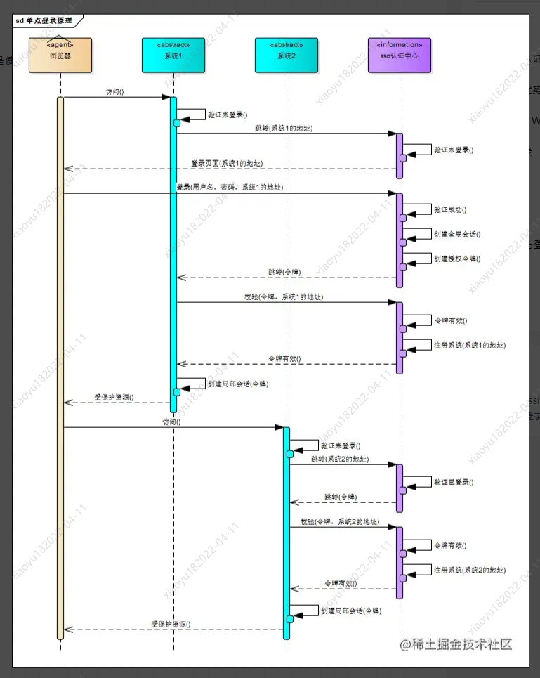

## session+cookie 认证

- 服务器需要存储 session_id
- 浏览器 cookie 存储 session_id

## token 认证

- token 里面是加密了的用户信息，服务器不需要存放 token, 可以直接解密判断用户信息是否正确进行认证

## jwt 认证

可以理解为（Header.Payload.Signature）三部分的 Token.  

### jwt - Header

header 部分是一个 json 对象描述 JWT 的元数据
{
alg: 'HS256', //签名的算法
type: 'JWT' //令牌的类型
}

### jwt-payload

payload 部分也是一个 json 对象，用来存放实际需要传递的数据

### signature

对 header 和 payload 部分通过指定的密钥进行签名。

## sso 单点登录

### 简单版单点登录

父域名 + 子域名

将 cookie 信息统一保存在父域名下面， 子域名设置 document.domain = 父域名， 共享 cookie。例如： wenku.baidu.com 、tieba.baidu.com，直接把 domain 设置为 baidu.com，cookie 保存在 baidu.com 域名下面

### 复杂版单点登录

创建一个 sso 认证中心，统一管理认证信息。  

## OAuth 第三方登录

微信登录 OAuth2.0 流程
