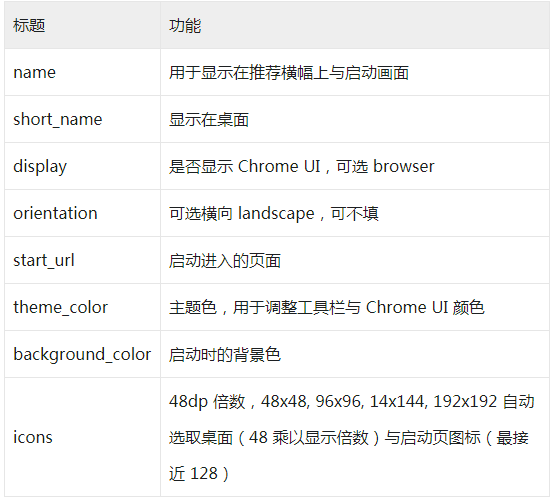

## mainifest.json

通过一系列的配置，可以是网页具备类似 APP 的效果（例如： 在手机桌面显示应用程序图标， 点击打开后展示启动页，等等）

> 在手机浏览器打开一个配置了 manifest.json 的网页

> 保存显示为桌面图标

> 点击图标，显示启动页面并且此时 url 地址栏也没有显示

## service worker

service worker 主要是用来做离线应用，也是通过一系列的配置，来配置需要离线的资源文件，启动事件等等

[Service Worker MDN](https://developer.mozilla.org/zh-CN/docs/Web/Progressive_web_apps/Offline_Service_workers)
