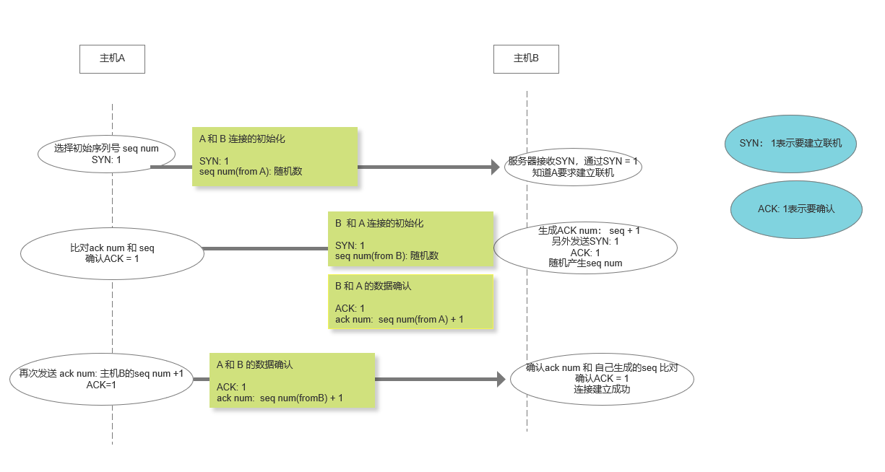
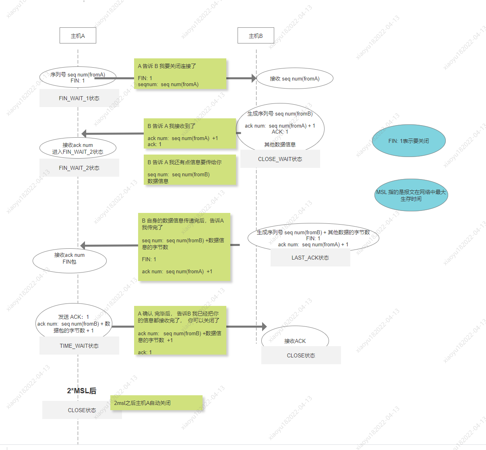

## 网络分层原理

### 应用层

- http, https, ssh, ftp, Dns

### 传输层

- Tcp, Udp, Sctp

### 网络层

- IPv4, Ipv6,

### 数据链路曾

- 以太网 ,无线 LAN

### 物理层

- 光纤，电缆，无线设备

## TCP 的特点

- 基于连接： 必须先建立连接才能进行通信
- 全双工： 客户端和服务端可以进行互相通信
- 字节流： 大数据传输： segment 分片， 重新排序， 重复的包会被丢弃
- 流量缓冲：首次握手传输的数据量只能是 4kb？
- 数据重发： 如果数据丢包，会重新进行数据的发送
- 拥塞控制

## TCP 的报文结构

源端口
目标端口

## 如何抓包分析

## TCP 的拥塞控制

## TCP 的重传

## TCP 的三次握手

- 通过 TCP 的三次握手，就建立了一个连接
- 客户端和浏览器端需要 3 个数据包， 握手是为了互相确认对方的接收和发送能力是否正常。
  ISN(Initial Sequence Number): TCP 发送方的字节数据编号的原点，告诉对方我要开始发送数据的初始化序列号
  Sequence Number： 数据包开始的序列号
  acknowledgement number ： 期望下一次接收的数据包开始的序列号
  `SYN`: synchronous 建立联机
  `ACK` : Acknowledgement 确认
  `PSH`: push 传送
  `FIN`： 完毕
  `RST`: reset 重传
  `URG`: 紧急

  

  ### TCP 的三次握手能不能换成两次？

  > 不能

- 确认双方的收发能力

  - TCP 第一次握手是为了确认 客户端的发送能力、服务端的接收能力

  - TCP 第二次握手是为了确认 服务端的接收能力、服务端的发送能力

  - TCP 第三次握手 确认 客户端的接收能力

  - 省略到任何一次都不能完全确认整个流程

- 两次不能判断数据是否丢失

- 阻止重复历史连接的初始化

### 半连接队列

服务器第一次接收到 SYN 之后，会处于 `SYN_RCVD` 的状态，用于存储这种状态的队列就是半连接队列。  
同样的如果完成了三次握手`established`状态，用于存储这种状态的就是全连接队列

## TCP 的四次挥手

之所以要四次挥手，是因为被要求关闭连接的一方可能存在未发送完毕的数据， 所以需要等待数据都发送完毕之后，在主动发起一次 FIN

### TCP 的四次挥手能不能减少？

> 不能

- 四次可以确认服务器全部发送完毕了消息，并且客户端也接收完毕了消息

### 为什么 TIME_WAIT 状态需要经过 2MSL 才能返回到 CLOSE 状态？

- 如果 2MSL 内没有任何新的请求到达客户端， 那么客户端认为本次连接可以断开
- 重传包的影响。 假设客户端在第四次挥手的时候，服务端发现接收到的的 seq num 不正确，那么会触发重传包。 此时会重复挥手流程，2MSL 内 客户端就会又接收到数据，就表示它不能关闭

超时重传指的是，发送数据包在一定的时间周期内没有收到相应的 ACK，等待一定的时间，超时之后就认为这个数据包丢失，就会重新发送。这个等待时间被称为 `RTO`.

- 避免新旧连接混淆

