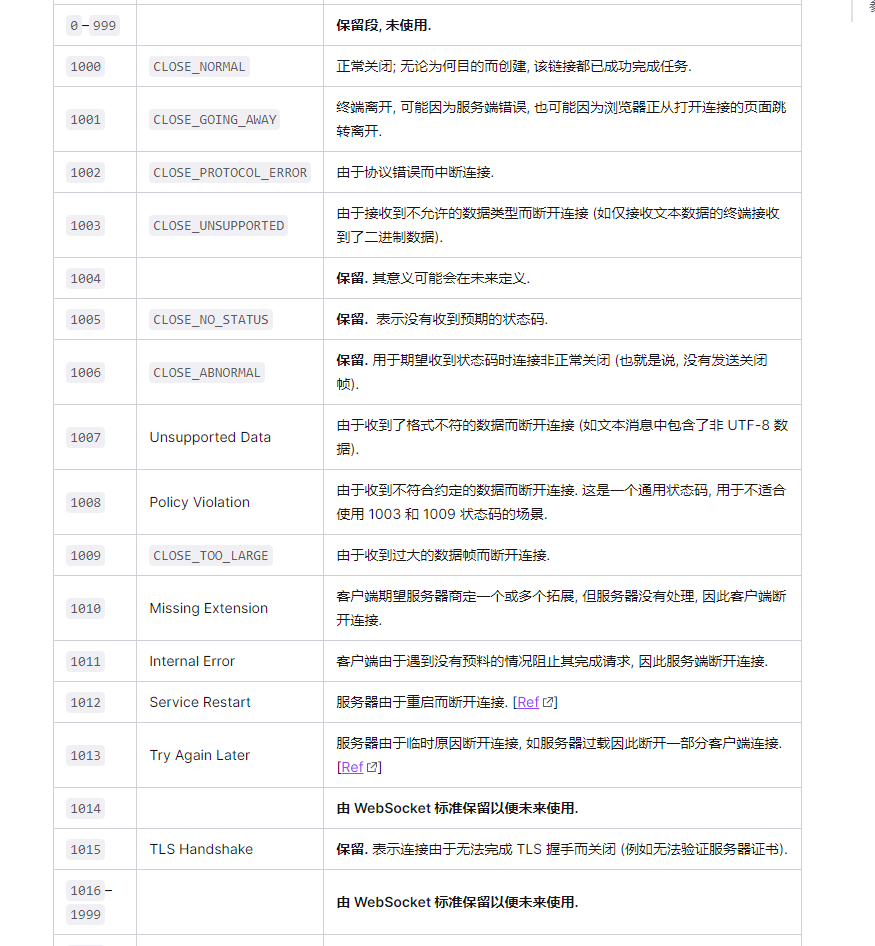

## 优点

- server push
- 首部开销非常小
- 支持扩展
- 二进制和文本传输
- 没有同源策略限制

## 语法（ws）

客户端

- ws.onopen()
- ws.onerror()
- ws.onclose()
- ws.onmessage()
- ws.send()
- ws.close()
- new WebSocket(url)
- ws.pong('', false, true);
- ws.readyState:
  - CONNECTING：值为 0，表示正在连接。
  - OPEN：值为 1，表示连接成功，可以通信了。
  - CLOSING：值为 2，表示连接正在关闭。
  - CLOSED：值为 3，表示连接已经关闭，或者打开连接失败。

```
<script>
  var ws = new WebSocket('ws://localhost:8080');
  // ws.addEventListener('open', function (event) {})
  ws.onopen = function () {
    console.log('ws onopen');
    ws.send('from client: hello'); // 发送ws消息
  };
  ws.onmessage = function (e) {
    console.log('ws onmessage');
    console.log('from server: ' + e.data);
    ws.close() // 关闭ws连接
  };

  ws.onclose = function(e) {
      console.log(e.code)
      // 1000: 正常关闭; 无论为何目的而创建, 该链接都已成功完成任务.
  }

  wx.onerror = function(e) {

  }
</script>
```

服务端

- new WebSocket.Server({port: 8080})
- ws.on('connection', fn)
- ws.on('message', fn)
- ws.on('close', fn)
- ws.close()
- ws.send()
- ws.on('error', fn)
- ws.ping('', false, true);

```
var app = require('express')();
var server = require('http').Server(app);
var WebSocket = require('ws'); // 引入websocket包

var wss = new WebSocket.Server({ port: 8080 });

wss.on('connection', function connection(ws) { // 客户端发送ws的8080请求，和服务器连接成功后，触发connection事件
    console.log('server: receive connection.');

    ws.on('message', function incoming(message) {  // 接收到客户端发送的信息触发的事件
        console.log('server: received: %s', message);
    });

    ws.send('world');  // 发送信息
});

app.get('/', function (req, res) {
  res.sendfile(__dirname + '/index.html');
});

app.listen(3000);

```

### 如何建立连接

websocket 复用了 http 的握手通道， 通过 http 协议与服务器协商协议升级（header 头部 `connection: Upgrade`, `Upgrade: websocket` 字段）

> Request

```
// request
GET ws://localhost:3000/ws/chat / HTTP/1.1  // 请求地址是一个ws的连接地址
Host: localhost:8080
Origin: http://127.0.0.1:3000

// 这里是主要的协议升级部分
Connection: Upgrade
Upgrade: websocket
Sec-WebSocket-Version: 13 // 表示websocket的版本。如果服务端不支持该版本，需要返回一个Sec-WebSocket-Versionheader，里面包含服务端支持的版本号。
Sec-WebSocket-Key: w4v7O6xFTi36lq3RNcgctw== // 与后面服务端响应首部的Sec-WebSocket-Accept是配套的，提供基本的防护，比如恶意的连接，或者无意的连接。
```

> Response

```
// response
HTTP/1.1 101 Switching Protocols //状态码101表示切换协议
Connection:Upgrade
Upgrade: websocket
Sec-WebSocket-Accept: Oy4NRAQ13jhfONC7bP8dTKb4PTU=
```

### 状态码



### 如何交换数据

客户端和服务器可以使用二进制，也可以使用文本来进行传输。通过二进制传输的时候，会有客户端数据包拆分发送（数据分片） 和 服务器接收整合的阶段

### 如何处理错误

### 如何维持/断开连接

### 数据帧格式
