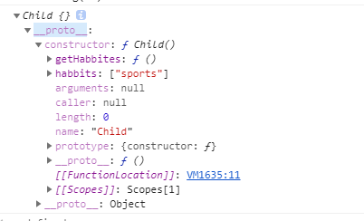
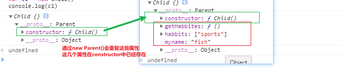

## 原型继承

```
Child.prototype = new Parent()
```

### 手写 new 函数

```
function myNew(fn, args) {
    var obj = {}
    Object.setPrototypeOf(obj, fn.prototype) // 相当于 obj.__proto__ = fn.prototype
    // 将obj作为this对象，执行函数
    const result = fn.apply(obj, args)
    return result instanceof Object ? result : obj
}
```

### 原型继承问题

> 如果原型上面有引用属性， 实例化之后的对象，会共享这个引用属性

```
function Parent() {
    this.name = 'fish'
    this.habbits = ['sports']
    this.getHabbites = function(){
        return this.habbits
    }
}
Parent.prototype.setName = function(name) {
    this.name = name
}
function Child() {

}
/*
** new Parent() 打印出一个对象，
{
    name: 'fish',
    habbits: ['sports'],
    getHabbites: fn,
    __proto__: {
        setName: ƒ (name)
        constructor: f Parent()
    }
}
*/
Child.prototype = new Parent()
var c1 = new Child()
var c2 = new Child()
c1.habbits.push('ddd')
console.log(c2.habbits) // 打印出来 ["sports", "ddd"]， 即使执行的是c1实例，但是c2也共享了这个值

```

## 构造函数继承

Parent.apply(Child, arguments)

### 手写 bind,apply, call

```
Function.prototype.mycall = function(obj) {
    const args = Array.from(arguments).slice(1) // 将类数组转化为数组，并且取得剩余参数
    // call的调用方式是 Fn.apply(target, arguments)
    // 那么当前this值 就相当于上面的Fn
    obj = obj || {}
    obj.fn = this
    obj.fn(...args) // 传递参数
    delete obj.fn
}

Function.prototype.myApply = function(obj, args) {
    // call和apply的唯一区别， 参数一个传递数组，一个传递字符串
    obj = obj || {}
    obj.fn = this
    obj.fn(...args)
    delete obj.fn
}

Function.prototype.myBind = function(obj, args) {
    // 需要注意this的值
    var self = this
    return function() {
        self.apply(context)
    }
}


function applyFunction(names) {
    this.names = names
}
var a = {a: 1}
applyFunction.mycall(a, 'fish')
const fn = applyFunction.bind(a, 'fish')
```

### 构造函数继承的问题

> 不能继承到父类在原型上面设置的属性

```
function Parent() {
    this.myname = 'fish'
    this.habbits = ['sports']
    this.getHabbites = function(){
        return this.habbits
    }
}
Parent.prototype.setName = function(name) {
    this.myname = name
}
function Child() {
    Parent.apply(Child, arguments)
}

var c1 = new Child()
console.log(c1)

```



## 组合继承

```
Child.prototype = new Parent()
Parent.call(Child, args)
Child.prototype.constructor = Child

```

### 组合继承的问题

```
function Parent() {
    this.myname = 'fish'
    this.habbits = ['sports']
    this.getHabbites = function(){
        return this.habbits
    }
}
Parent.prototype.setName = function(name) {
    this.myname = name
}
function Child() {
    Parent.apply(Child, arguments)
}
Child.prototype = new Parent()
Child.prototype.constructor = Child
var c1 = new Child()
console.log(c1)

```

## 寄生组合式继承

```
Child.prototype = Object.create(Parent.prototype)

Parent.call(Child, args)

Child.prototype.constructor = Child

```

> Child.prototype = Object.create(Parent.prototype) 和 Child.prototype = new Parent()

`new Parent()` 其实就是 在 `Object.create(Parent.prototype)` 的基础上有多进行了一次 构造函数继承 （在手写 new 函数中可以看出）， 这一步其实是多余的


