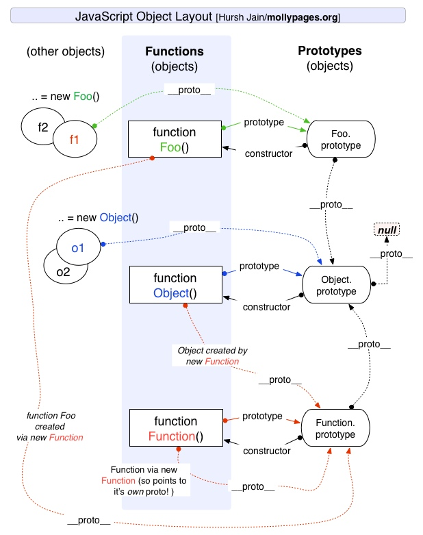
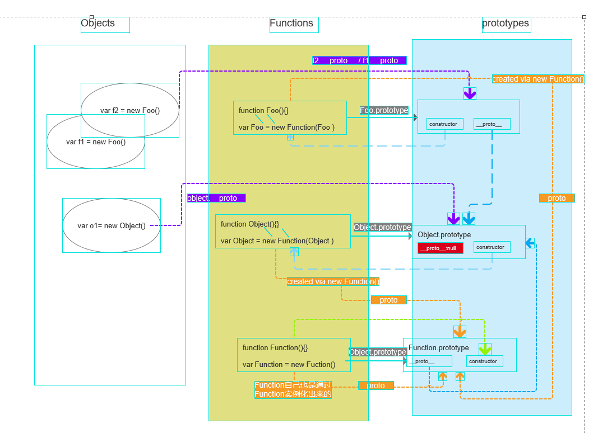

## 原型链

对象进行属性查找的时候，如果自身不存在该属性，会在他的隐形原型（**proto**）属性上继续往上一层查找， 知道查找到最终`__proto__ = null`的时候为止

### 结论点

- 所有的函数 fn 都是 Function 的实例: fn.**proto** === Function.prototype

- 对象的隐式原型就是构造函数的显示原型：

```
var o = new Object()
o.__proto__ === Object.prototype

function Foo() {}
var f = new Foo()
f.__proto__ === Foo.prototype
```

### 原型链示意图



