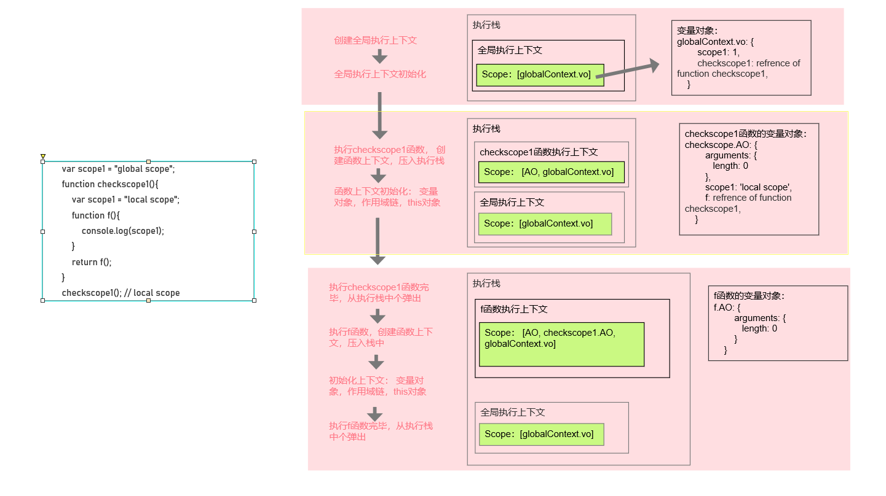
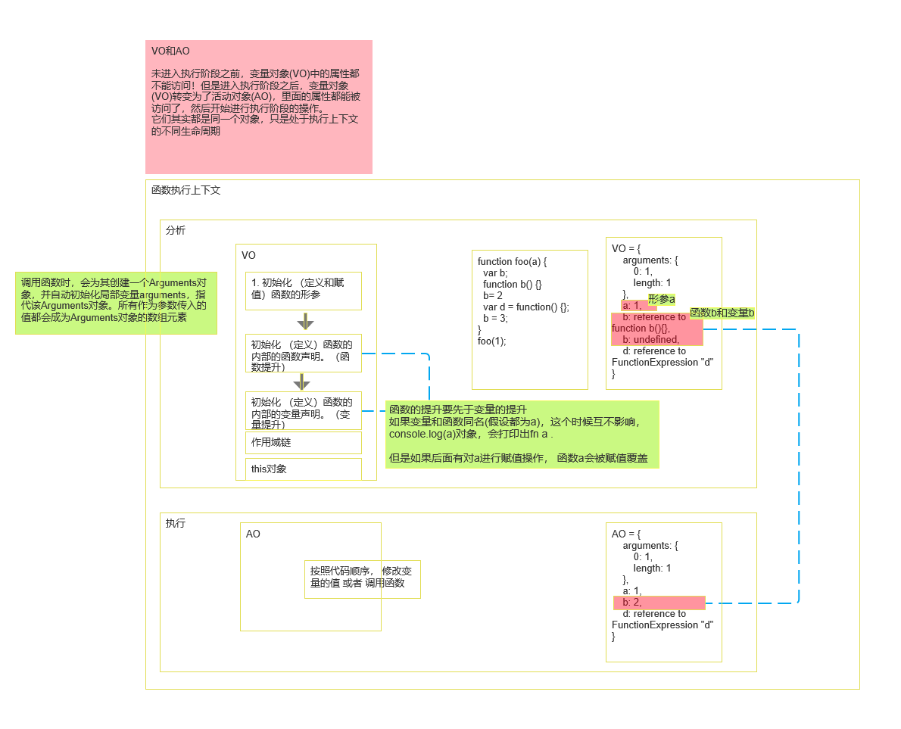

## 作用域

### 词法作用域

词法作用域是在函数定义的时候确定的，由函数申明的位置决定。JS 使用的就是词法作用域

### 创建作用域的流程

### VO,AO,Go,闭包

- Go 其实指的就是全局的活动变量
- VO 是函数执行之前的活动变量
- AO 是函数执行之后的活动变量

### VO 创建的流程

#### VO 和 AO

未进入执行阶段之前，变量对象(VO)中的属性都不能访问！  
但是进入执行阶段之后，变量对象(VO)转变为了活动对象(AO)，里面的属性都能被访问了，然后开始进行执行阶段的操作。
它们其实都是同一个对象，只是处于执行上下文的不同生命周期

### [闭包](./closure.md)
